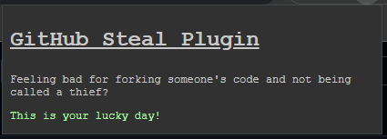

# Github steal plugin

This plugin replaces every "fork" strings with "steal".

You might be a thief but at least you're honest when using this plugin. 👍

## Installation

This plugin was only tested on chrome, so if you have issues, please consider rethinking your life choices and use 
chrome instead. 

If you're having troubles installing on chrome, it's definitely your fault.

To install,
 - download the source as zip file
 - extract it to a folder
 - go to [chrome extensions](chrome://extensions/)
 - enable **developer mode**
 - click on **load unpacked extension**
 - navigate to the extracted plugin and select its folder

That's it, you are now an honest github user.